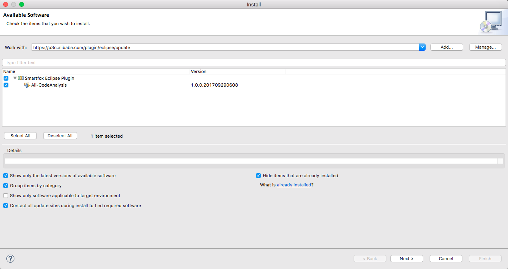
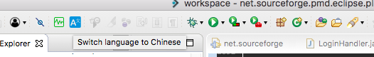
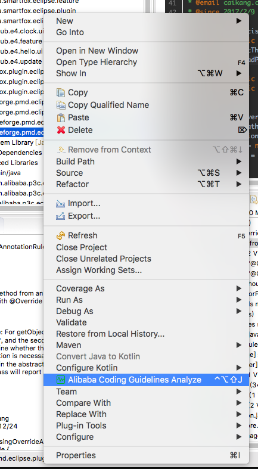
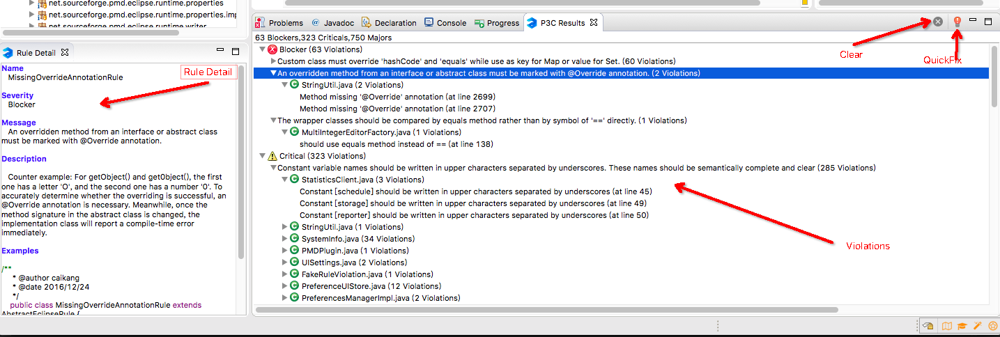

# Eclipse Plugin
---
## <font color="green">Prepare</font>
- Eclipse Juno+ 
- maven3.+
- JDK 1.7+

## <font color="green">Build</font>
```
mvn -U clean install
```
## [中文使用手册](README_cn.md)
## <font color="green">Install</font>
1. <font color="blue">Help >> Install New Software
then enter this update site URL [https://p3c.alibaba.com/plugin/eclipse/update](https://p3c.alibaba.com/plugin/eclipse/update)</font>

 

2. <font color="blue">Follow the wizard, restart Eclipse to take effect after install success.</font>

## <font color="green">Use</font>
1. <font color="blue">Switch language</font>

	 

2. <font color="blue">Code Analyze </font>

   
  
   
    
