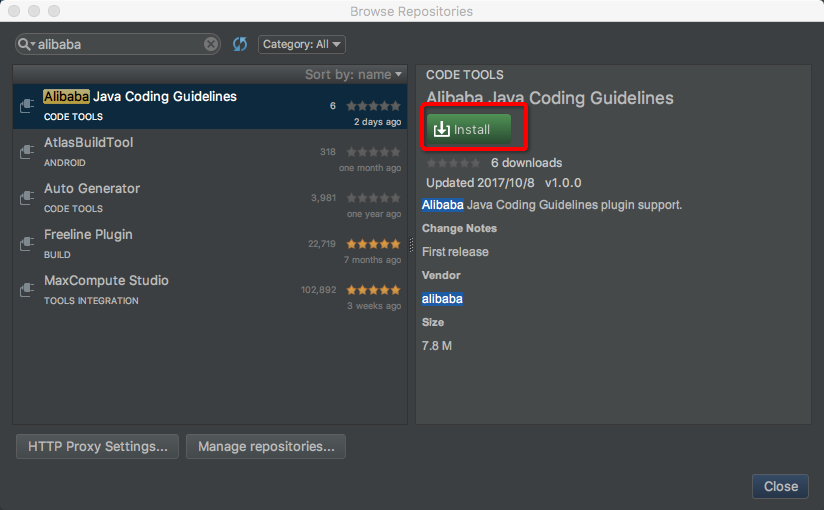

# Idea Plugin 
---
## <font color="green">Prepare</font>
- Project JDK: 1.7+
- Gradle: 3.0+（Require JDK1.8+ for gradle）

## <font color="green">Build</font>
```
cd p3c-idea
../gradlew clean buildPlugin
```

## <font color="green">Run plugin</font>

```
cd p3c-idea
../gradlew runIde
# run specific IDEA
../gradlew runIde -Pidea_version=2018.3
```

## <font color="green">Use p3c-common as your plugin dependency</font>
```groovy
compile 'com.alibaba.p3c.idea:p3c-common:1.0.0'
```
## [中文使用手册](README_cn.md)
## <font color="green">Install</font>
### Install from repositories
1. <font color="blue">Settings >> Plugins >> Browse repositories... </font>

     

2. <font color="blue"> Search plugin by keyword 'alibaba' then install 'Alibaba Java Coding Guidelines' plugin </font>

     

3.  <font color="blue">Restart to take effect. </font>
### Install from local zip file.
1. Open https://plugins.jetbrains.com/plugin/10046-alibaba-java-coding-guidelines and download the latest version zip file.
    
2. Settings >> Plugins >> Install plugin from disk...,select the downloaded zip file in previous step then restart your idea
    

## <font color="green">Use</font>

1. <font color="blue">Switch language</font>

	 

2. <font color="blue">Inspections</font>  

	 
	
	  

3. <font color="blue">Code Analyze</font>  

	  
	
	<font color="blue">We use the idea standard Inspection Results to show our violations.</font>  
	 
	  
	
	<font color="blue">We can also analyze file which is modified before vcs checkin.</font>  
	
	 

## <font color="green">Other</font>
1. <font color="blue">[中文乱码解决方法](https://github.com/alibaba/p3c/issues/32#issuecomment-336762512)</font>

	* <font color="blue">Appearance&Behavior -> Appearance -> UI Options -> Name 里面设置成微软雅黑（microsoft yahei light）</font>

	    
 
	* <font color="blue">Switch Language to English and restart.</font>

	    

