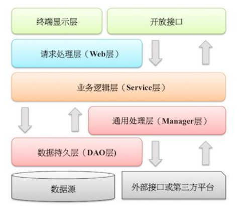

# 六、工程结构
## (一) 应用分层 

1. 【推荐】图中默认上层依赖于下层，箭头关系表示可直接依赖，如：开放接口层可以依赖于Web层，也可以直接依赖于Service层，依此类推：
 
 - 开放接口层：可直接封装Service方法暴露成RPC接口；通过Web封装成http接口；进行网关安全控制、流量控制等。 
 - 终端显示层：各个端的模板渲染并执行显示的层。当前主要是velocity渲染，JS渲染，JSP渲染，移动端展示等。 
 - Web层：主要是对访问控制进行转发，各类基本参数校验，或者不复用的业务简单处理等。 
 - Service层：相对具体的业务逻辑服务层。 
 - Manager层：通用业务处理层，它有如下特征：
  1） 对第三方平台封装的层，预处理返回结果及转化异常信息；
  2） 对Service层通用能力的下沉，如缓存方案、中间件通用处理；
  3） 与DAO层交互，对多个DAO的组合复用。
 - DAO层：数据访问层，与底层MySQL、Oracle、Hbase等进行数据交互。 
 - 外部接口或第三方平台：包括其它部门RPC开放接口，基础平台，其它公司的HTTP接口。

2. 【参考】（分层异常处理规约）在DAO层，产生的异常类型有很多，无法用细粒度的异常进行catch，使用catch(Exception e)方式，并throw new DAOException(e)，不需要打印日志，因为日志在Manager/Service层一定需要捕获并打印到日志文件中去，如果同台服务器再打日志，浪费性能和存储。在Service层出现异常时，必须记录出错日志到磁盘，尽可能带上参数信息，相当于保护案发现场。如果Manager层与Service同机部署，日志方式与DAO层处理一致，如果是单独部署，则采用与Service一致的处理方式。Web层绝不应该继续往上抛异常，因为已经处于顶层，如果意识到这个异常将导致页面无法正常渲染，那么就应该跳转到友好错误页面，加上用户容易理解的错误提示信息。开放接口层要将异常处理成错误码和错误信息方式返回。

3. 【参考】分层领域模型规约：
  - DO（Data Object）：与数据库表结构一一对应，通过DAO层向上传输数据源对象。
  - DTO（Data Transfer Object）：数据传输对象，Service或Manager向外传输的对象。
  - BO（Business Object）：业务对象。由Service层输出的封装业务逻辑的对象。
  - AO（Application Object）：应用对象。在Web层与Service层之间抽象的复用对象模型，极为贴近展示层，复用度不高。
  - VO（View Object）：显示层对象，通常是Web向模板渲染引擎层传输的对象。
  - Query：数据查询对象，各层接收上层的查询请求。注意超过2个参数的查询封装，禁止使用Map类来传输。